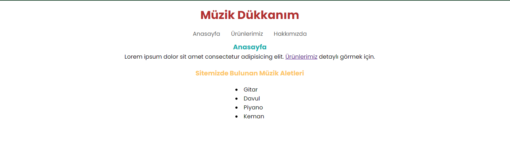
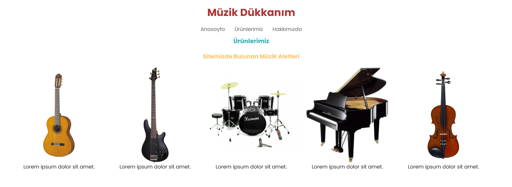
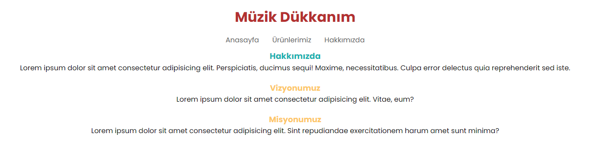

# CSS Patika **First Homework**

<<<<<<< HEAD
### | Basic Documents 
=======
## | Basic Documents 
>>>>>>> 2c4eccd6ea77c219542bb05962383cfb448ffc8f

* `index.html` This project's home page. And I am showing short story.

* `storage.html` Showing, Which I have product? 

* `main.html` Vision & Mission

<<<<<<< HEAD
## | **It's basic work ladies & gents. =] I'm trying for progress** İf you have offer, I listen to you. Thank you... **mad love, peace out 🕊**
=======
### | **It's basic work ladies & gents. =] I'm trying for progress** İf you have offer, I listen to you. Thank you... **mad love, peace out 🕊**
>>>>>>> 2c4eccd6ea77c219542bb05962383cfb448ffc8f

